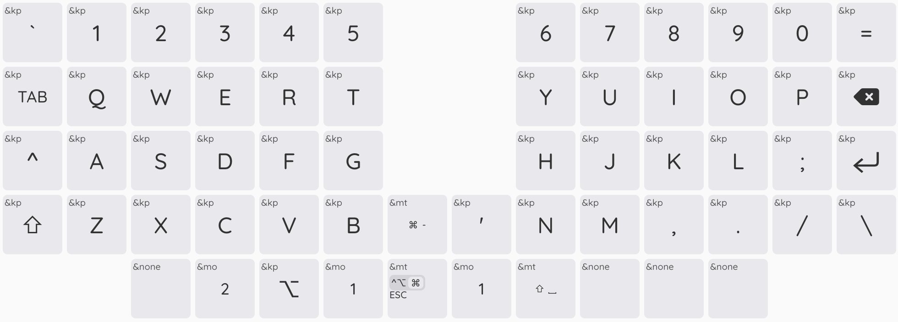
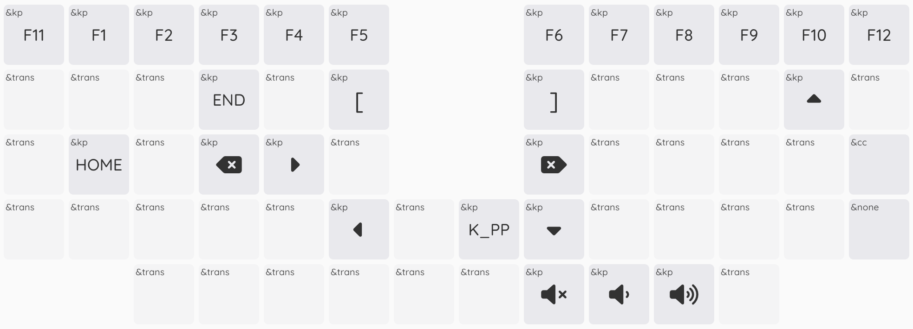
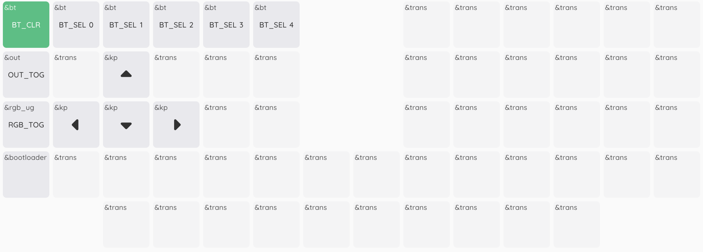
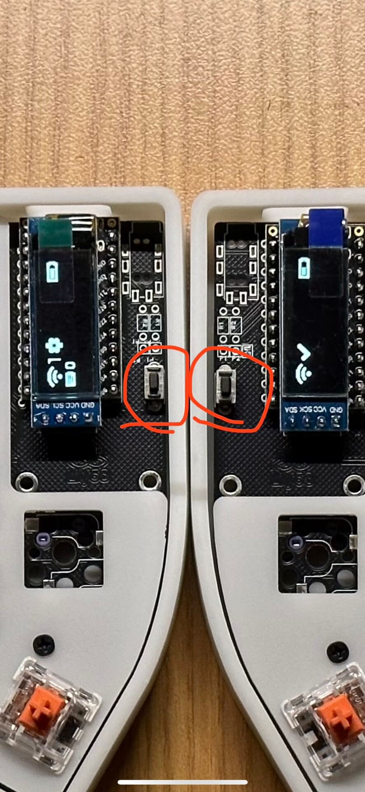

## 改键

当前键位：

1. 进入 https://nickcoutsos.github.io/keymap-editor/ 绑定当前仓库；
2. 改键完成后点「Save」保存键位配置到 git 仓库，触发 Github Action 完成编译后，下载编译好的固件；
3. 双击键盘上的「Reset」按钮，进入 USB 模式，此时电脑能识别到一个 USB 设备（类似 U 盘），将新的固件拖进去即可；
   - 固件的文件名无所谓，拖进去后 macbook 会自动断开设备（显示设备非预期断开），但实际上固件烧录成功了；
   - 设备中的固件文件名固定是 `CURRENT.uf2`，烧录成功后也没有任何变化，不用在意；
   - 「Reset」按钮的位置：

      

如果只是改键位，左右手分别放入对应的固件即可。比如左手放入 `sofle_left-nice_nano_v2-zmk.uf2`，右手放入 `sofle_right-nice_nano_v2-zmk.uf2`。
如果要重置固件，需要按顺序操作：

1. 左右手先烧录 `settings_reset-nice_nano_v2-zmk.uf2`，左右同时按一下「Reset」按钮，完成左右手的蓝牙配对；
2. 右手按「改键位」的流程烧录 `sofle_right-nice_nano_v2-zmk.uf2`；
3. 左手按「改键位」的流程烧录 `sofle_left-nice_nano_v2-zmk.uf2`；
4. 默认固件都放在了 `assets/firmware` 目录下；

## 硬件

- 主控: nice!nano v2.0
- 电池: 3.7V 2000mAh 聚合物锂电池